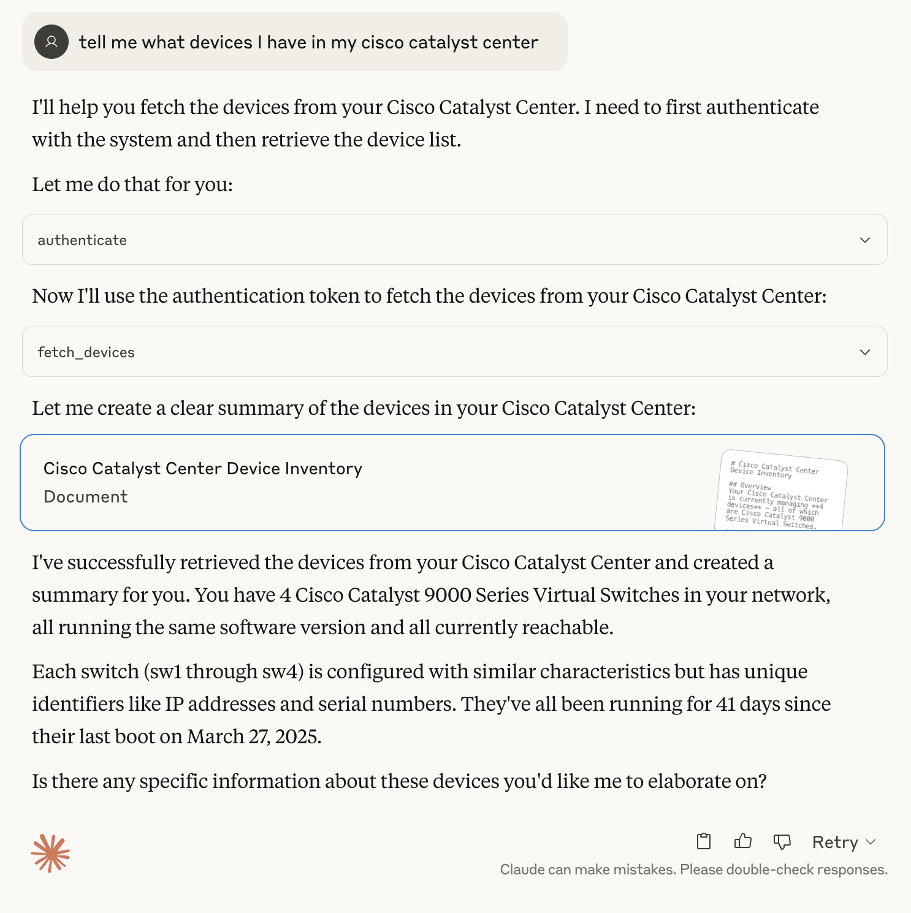
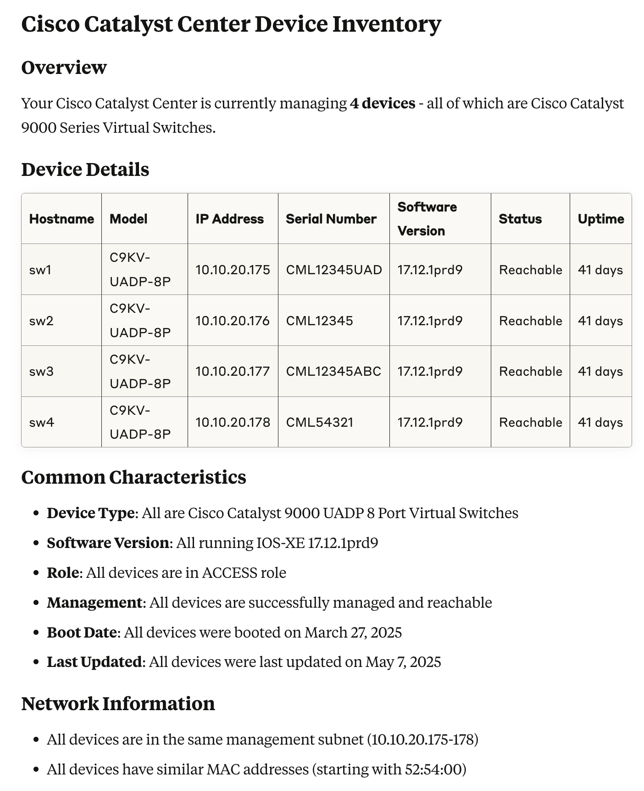

# Catalyst Center MCP

A Python-based MCP (Model Context Protocol) server for Cisco Catalyst Center (formerly DNA Center) that provides tools for device management and monitoring.

## Features

- Authentication with Catalyst Center
- Device discovery and listing
- Interface information retrieval
- Simple and extensible MCP server implementation

## Installation

1. Clone the repository:
```bash
git clone https://github.com/richbibby/catalyst-center-mcp.git
cd catalyst-center-mcp
```

2. Create a virtual environment and activate it:
```bash
python -m venv venv
source venv/bin/activate  # On Windows: venv\Scripts\activate
```

3. Install dependencies:
```bash
pip install -r requirements.txt
```

## Configuration

1. Copy the example environment file:
```bash
cp .env.example .env
```

2. Update the `.env` file with your Catalyst Center credentials:
```env
CCC_HOST=your-catalyst-center-host
CCC_USER=your-username
CCC_PWD=your-password
```

## Usage With Claude Desktop Client

1. Configure Claude Desktop to use this MCP server:

- Open Claude Desktop
- Go to Settings > Developer > Edit Config
- Add the following configuration file `claude_desktop_config.json`

```  
{
  "mcpServers": {
    "catalyst-center-mcp": {
      "command": "/Users/rich/dev/ccc_mcp/venv/bin/fastmcp",
      "args": [
        "run",
        "/Users/rich/dev/ccc_mcp/catalyst-center-mcp.py"
      ]
    }
  }
}
```

- Replace the path's above to reflect your local environment.

2. Restart Claude Desktop

3. Interact with Claude Desktop:

- Ask Claude to perform actions like "Show me the devices in my Cisco Catalyst Center"
- Claude will use the MCP server to authenticate and fetch device information





## Example Questions

Here are some example questions you can ask Claude to interact with your Catalyst Center:

### Device Information
- "Show me all devices in my network"
- "List all switches in my network"
- "What devices are currently unreachable?"
- "Show me devices with hostname containing 'switch'"
- "What's the status of device with IP 10.1.1.1?"

### Interface Information
- "Show me all interfaces for device X"
- "What interfaces are down on device Y?"
- "List all Gigabit interfaces on device Z"
- "Show me interfaces with IP addresses"
- "What's the status of interface GigabitEthernet1/0/1 on device X?"

### Site Information
- "Show me all sites in my network"
- "What devices are in site X?"
- "List all buildings in my network"
- "Show me the site hierarchy"
- "What's the address of site Y?"

### Combined Queries
- "Show me all devices in site X and their interfaces"
- "List all down interfaces across all devices"
- "What devices in building Y have unreachable interfaces?"
- "Show me the network topology for site Z"
- "What's the status of all devices in area A?"

## Available Tools

- `authenticate`: Authenticates with Cisco Catalyst Center and returns a token
- `fetch_sites`: Fetches a list of sites from Cisco Catalyst Center
- `fetch_devices`: Fetches a list of devices from Cisco Catalyst Center
- `fetch_interfaces`: Fetches interface information for a specific device

## Contributing

1. Fork the repository
2. Create your feature branch (`git checkout -b feature/amazing-feature`)
3. Commit your changes (`git commit -m 'Add some amazing feature'`)
4. Push to the branch (`git push origin feature/amazing-feature`)
5. Open a Pull Request

## License

This project is licensed under the MIT License - see the [LICENSE](LICENSE) file for details. 